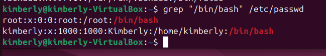

# Investigation 03 – User Account & Login Review

## Objective
Review local user accounts and login activity to identify any unauthorized or unusual user behavior.

## Environment
- Ubuntu Linux (VirtualBox VM)

## Data Reviewed
- /etc/passwd
- /etc/shadow (awareness only)
- Login history (who, last)

## Investigation Steps
1. Reviewed local user accounts
2. Identified users with login shells
3. Checked recent login activity
4. Evaluated whether accounts and logins appeared expected

## Commands Used
```bash
cat /etc/passwd
grep "/bin/bash" /etc/passwd
who
last
```

## Findings
- Reviewed local user accounts and identified two login-capable users.
- Confirmed the active logged-in user was the local user `kimberly`.
- Login history showed only expected user activity with no unknown or unauthorized users.
- No evidence of suspicious user accounts or abnormal login behavior was observed.

## Conclusion
Based on the review of user accounts and login activity, no unauthorized or suspicious user behavior was identified. All observed user accounts and login sessions were expected and consistent with normal system usage. No further action is required at this time.

## Next Steps
- Run user and login-related commands in the Ubuntu VM
- Capture screenshots of relevant command output
- Determine whether any unauthorized or suspicious user accounts or login activity exist

## Evidence



